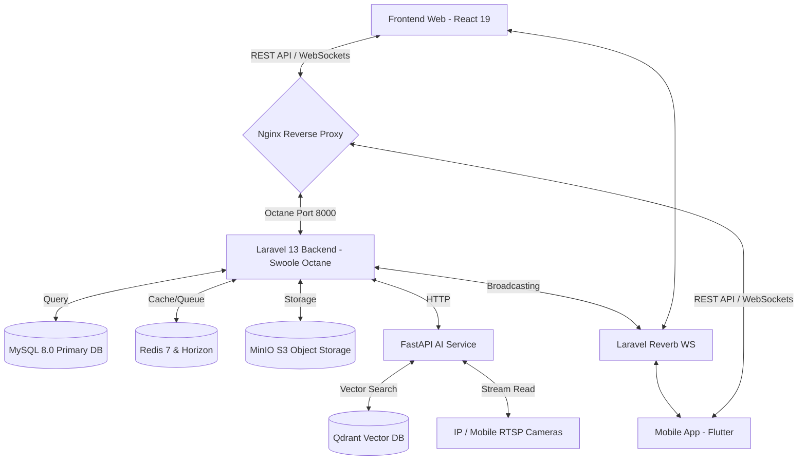

# StayHub - Hệ Thống Quản Lý Căn Hộ, Phòng Trọ & Ký Túc Xá Thông Minh

**StayHub** (repokytucxaphongtro) là một hệ thống quản lý thuê phòng trọ, căn hộ dịch vụ và ký túc xá toàn diện, ứng dụng công nghệ hiện đại. Dự án được cấu trúc theo mô hình **Monorepo** bao gồm đầy đủ các phân hệ từ Backend, Frontend Web, Mobile App cho đến dịch vụ xử lý AI thời gian thực.

---

## 1. Kiến Trúc Tổng Quan & Công Nghệ (System Architecture)

StayHub được thiết kế để vận hành mượt mà, chịu tải cao và hỗ trợ giao tiếp thời gian thực cũng như tích hợp xử lý hình ảnh qua AI. Cấu trúc công nghệ của hệ thống bao gồm:



### 1.1. Backend (`BE_StayHub`)
* **Framework**: Laravel 13, vận hành trên nền **Swoole Octane** để tối ưu hóa hiệu năng, giảm thời gian phản hồi API gần như bằng 0.
* **Database chính**: MySQL 8.0 lưu trữ thông tin nghiệp vụ với hệ thống 38 bảng chặt chẽ.
* **Caching & Queue**: Redis 7 kết hợp Laravel Horizon để quản lý hàng đợi bất đồng bộ (gửi mail, thông báo, tác vụ tính toán nặng).
* **Real-time**: Laravel Reverb cung cấp máy chủ WebSocket tích hợp, truyền phát sự kiện tức thời (tin nhắn chat, cảnh báo cháy).
* **Object Storage**: MinIO (tương thích AWS S3) dùng để lưu trữ ảnh đại diện, tệp tin hợp đồng, ảnh chụp sự cố và FaceID credentials.

### 1.2. Frontend Web (`FE_StayHub`)
* **Công nghệ chính**: React 19, TypeScript, Vite.
* **Style System**: TailwindCSS v4 tối ưu hóa hiệu năng render giao diện.
* **Routing**: React Router v7.
* **State & Form**: React Hook Form, Axios.
* **Chức năng**: Gồm phân hệ **Admin** (Quản lý tòa nhà, phòng, dịch vụ, hóa đơn, sự cố, camera AI, chat trực tiếp) và **Tenant** (Xem hóa đơn, lịch sử thanh toán, trò chuyện).

### 1.3. Frontend Mobile (`FE_StayHub_Mobile`)
* **Công nghệ**: Flutter (Dart) phát triển ứng dụng di động đa nền tảng (iOS & Android).
* **Chức năng dành cho Khách thuê (Tenant)**:
  - Đăng ký và ký hợp đồng điện tử (vẽ chữ ký trực tiếp trên màn hình di động).
  - Nhận thông báo đẩy (Push Notifications) thời gian thực.
  - Xem hóa đơn và thanh toán qua cổng QR Code động tự sinh (VietQR).
  - Gửi yêu cầu sửa chữa/bảo trì kèm ảnh chụp thực tế và đánh giá chất lượng (rating).
  - Giám sát mức tiêu thụ điện nước hàng tháng qua biểu đồ trực quan.
* **Chức năng dành cho Quản lý (Admin)**:
  - Quản lý trạng thái phòng trống/đã thuê.
  - Chốt chỉ số điện nước nhanh chóng bằng cách nhập chỉ số công tơ.
  - Tiếp nhận và cập nhật trạng thái sửa chữa thiết bị.
  - Trò chuyện trực tiếp (real-time chat) với khách thuê.

### 1.4. AI Service (`ai-service`)
* **Công nghệ**: Python FastAPI, OpenCV, DeepFace, Uvicorn.
* **Chức năng chính**:
  1. **Đăng ký & Xác thực FaceID**: Trích xuất vector đặc trưng khuôn mặt (Facenet model 128 chiều) từ ảnh chụp camera di động của admin/khách thuê, thực hiện kiểm tra chống giả mạo (Anti-spoofing) và kiểm tra chuyển động sống (Liveness check) trước khi lưu trữ vector vào **Qdrant Vector Database**.
  2. **Nhận diện cháy nổ & hút thuốc**: Kết nối trực tiếp luồng camera RTSP/MJPEG, định kỳ chụp khung hình (frames) gửi phân tích qua mô hình thị giác máy tính GPT-4o (OmniRoute API) để phát hiện khói, lửa hoặc hành vi hút thuốc tại các khu vực cấm.

---

## 2. Đặc Tả Cơ Sở Dữ Liệu (Database Specification - 38 Bảng)

Cơ sở dữ liệu của StayHub bao gồm 38 bảng được chuẩn hóa, chia thành các phân hệ nghiệp vụ sau:

### 2.1. Phân hệ Người Dùng & Xác Thực
* `admins`: Lưu trữ thông tin tài khoản quản trị viên và quản lý tòa nhà, đường dẫn FaceID.
* `tenants`: Lưu trữ hồ sơ thông tin cá nhân khách thuê, ảnh CCCD/hộ chiếu.
* `notification_reads`: Ghi nhận trạng thái đọc thông báo của admin và tenant.
* `admin_logs` (Liên kết trong model): Log lại chi tiết mọi thao tác nghiệp vụ của Admin.

### 2.2. Phân hệ Tòa Nhà & Phòng Ốc
* `regions`: Cấu trúc phân cấp các khu vực quản lý địa lý.
* `buildings`: Các tòa nhà/khu chung cư mini thuộc các khu vực khác nhau.
* `building_images`: Lưu trữ danh sách ảnh chụp của tòa nhà.
* `room_types`: Định nghĩa các loại phòng (phòng đơn, phòng đôi, penthouse...).
* `rooms`: Chi tiết các căn phòng trong tòa nhà (số phòng, tầng, diện tích, giá gốc, số người ở tối đa).
* `room_images`: Lưu trữ ảnh chụp chi tiết của từng phòng.

### 2.3. Phân hệ Tài Sản & Dịch Vụ
* `asset_templates`: Danh mục các loại tài sản mẫu của tòa nhà (điều hòa, tủ lạnh, giường...).
* `room_assets`: Chi tiết số lượng và hiện trạng tài sản được trang bị trong từng phòng cụ thể.
* `services`: Danh mục các dịch vụ tiện ích cung cấp (điện, nước, internet, gửi xe, dọn vệ sinh...).
* `service_prices`: Đơn giá dịch vụ áp dụng cho từng tòa nhà theo khoảng thời gian hiệu lực.
* `room_services`: Bảng nối phòng và dịch vụ đang áp dụng cho từng phòng; không lưu giá.
* `room_service_prices`: Đơn giá dịch vụ phòng theo thời gian, gồm giá mặc định của phòng và giá deal theo hợp đồng.

### 2.4. Phân hệ Công Tơ & Đo Lường
* `meter_devices`: Các thiết bị công tơ lắp đặt tại phòng (công tơ điện, đồng hồ nước).
* `meter_readings`: Chỉ số tiêu thụ điện nước được ghi nhận hàng tháng (chỉ số cũ, chỉ số mới, sản lượng tiêu thụ, ảnh minh chứng công tơ).

### 2.5. Phân hệ Hợp Đồng & Biến Động
* `contracts`: Hợp đồng thuê phòng chính (mã hợp đồng, ngày hiệu lực, ngày hết hạn, giá thuê thỏa thuận, tiền cọc, chữ ký điện tử, trạng thái thanh toán cọc).
* `contract_tenants`: Bảng trung gian liên kết danh sách khách thuê đang cư trú thực tế trong căn phòng theo hợp đồng.
* `room_movements`: Lịch sử biến động phòng (khách nhận phòng, trả phòng, chuyển phòng tự động, các khoản cấn trừ và hoàn trả cọc).
* `vehicles`: Hồ sơ phương tiện (xe máy, xe đạp, ô tô) của khách thuê.
* `contract_vehicles`: Danh sách xe đăng ký gửi theo hợp đồng kèm đơn giá và chu kỳ tính phí gửi xe.
* `contract_deposit_transactions`: Nhật ký giao dịch đóng tiền cọc hoặc hoàn trả cọc của hợp đồng.

### 2.6. Phân hệ Hóa Đơn & Thanh Toán
* `invoices`: Hóa đơn tiền phòng và dịch vụ hàng tháng (mã hóa đơn, kỳ hóa đơn, số tiền nợ cũ, tổng tiền cần đóng, trạng thái đóng tiền).
* `invoice_items`: Chi tiết từng khoản phí trong hóa đơn (tiền phòng, tiền điện, tiền nước, tiền dịch vụ cố định).
* `invoice_reminder_logs`: Lịch sử hệ thống tự động hoặc admin gửi thông báo nhắc nợ hóa đơn quá hạn.
* `invoice_debt_rollovers`: Ghi nhận các khoản nợ hóa đơn chưa đóng được kết chuyển (cộng dồn) sang hóa đơn kỳ kế tiếp.
* `payments`: Các giao dịch đóng tiền thực tế của khách thuê (mã giao dịch, số tiền đóng, ảnh biên lai chuyển khoản, mã đối chiếu SePay, trạng thái duyệt).

### 2.7. Phân hệ Sự Cố & Bảo Trì
* `maintenance_requests`: Phiếu yêu cầu sửa chữa trang thiết bị bị hỏng từ khách thuê gửi lên.
* `maintenance_request_logs`: Nhật ký thay đổi trạng thái xử lý phiếu bảo trì (Tiếp nhận -> Đang sửa -> Hoàn tất).
* `maintenance_feedbacks`: Đánh giá của khách thuê về chất lượng sửa chữa (điểm số rating 1-5 sao, ý kiến phản hồi, ảnh nghiệm thu).

### 2.8. Phân hệ Tương Tác & Truyền Thông
* `notifications`: Các thông báo hệ thống được phát đi (thông báo chung tòa nhà, nhắc đóng tiền, cảnh báo an toàn).
* `chat_conversations`: Các cuộc hội thoại trò chuyện (giữa quản lý - khách thuê, hoặc quản lý - quản trị hệ thống).
* `chat_messages`: Nội dung các tin nhắn văn bản, tệp đính kèm gửi qua lại thời gian thực.
* `settings`: Các tham số thiết lập cấu hình riêng biệt cho từng tòa nhà.

### 2.9. Phân hệ Chi Phí & An Ninh AI
* `expense_categories`: Danh mục phân loại các khoản chi phí vận hành (sửa chữa tòa nhà, đóng tiền rác tổng, lương bảo vệ...).
* `expenses`: Chi tiết các phiếu chi phát sinh trong quá trình vận hành tòa nhà.
* `security_cameras`: Thông tin cấu hình camera giám sát an ninh (địa chỉ RTSP stream, cấu hình tần suất giám sát AI).
* `fire_safety_alerts`: Nhật ký cảnh báo phát hiện khói, lửa hoặc hành vi hút thuốc từ camera AI gửi về kèm ảnh chụp bằng chứng.

---

## 3. Quy Trình Nghiệp Vụ Cốt Lõi (Core Workflows)

### 3.1. Đăng Nhập Bằng Nhận Diện Khuôn Mặt (FaceID Auth)
Hệ thống sử dụng luồng xác thực đa lớp để chống giả mạo ảnh tĩnh:
```
[User chụp 2-3 ảnh liên tiếp trên App] 
            │
            ▼
[Gửi lên Laravel Backend] ──(API HTTP)──> [FastAPI AI Service]
                                                │
                                                ├─> Kiểm tra độ sáng, độ nhiễu (OpenCV)
                                                ├─> Trích xuất khuôn mặt chính (DeepFace)
                                                ├─> Liveness check (Phân tích chuyển động giữa các frame)
                                                ├─> Tạo Vector đặc trưng 128 chiều (Facenet)
                                                │
                                                ▼
[Laravel nhận Vector] ──(Search)──> [Qdrant DB (Face collection)]
                                                │
                                                ▼
                             [So khớp score >= threshold (95%)]
                                                │
                                                ▼
                                    [Trả về ID -> Đăng nhập thành công]
```

### 3.2. Cảnh Báo Phòng Chống Cháy Nổ Thời Gian Thực (AI Fire Safety Alert)
Hệ thống giám sát camera liên tục và phát cảnh báo không đồng bộ thông qua các bước:
1. **Quét lịch trình**: Laravel Scheduler gọi FastAPI định kỳ gửi luồng phân tích camera.
2. **Lấy khung hình**: FastAPI kết nối luồng RTSP của Camera để lấy chuỗi khung hình liên tiếp.
3. **Phân tích hình ảnh**: Gửi các khung hình sang mô hình Vision GPT-4o để phát hiện khói, lửa hoặc người hút thuốc tại khu vực cấm.
4. **Xử lý kết quả**: Nếu phát hiện nguy cơ (`risk_level` là `danger` hoặc `critical`):
   - FastAPI trả về kết quả kèm ảnh chụp bằng chứng (Base64).
   - Laravel lưu cảnh báo vào bảng `fire_safety_alerts`.
   - Phát sự kiện qua **Laravel Reverb WebSocket** để hiển thị cảnh báo đỏ nổi bật (pop-up + âm thanh còi hú) trên tất cả màn hình Admin Web và App Mobile.
   - Gửi đẩy thông báo hệ thống đến thiết bị di động của các Admin quản lý tòa nhà đó.

### 3.3. Tự Động Hóa Chuyển Phòng & Trả Phòng (Room Movements)
Quy trình chuyển phòng được thiết kế chặt chẽ tránh thất thoát tài chính:
1. **Lên lịch chuyển phòng**: Admin lên lịch chuyển khách thuê từ phòng cũ sang phòng mới vào ngày chỉ định.
2. **Kiểm tra công nợ**: Đến ngày chuyển, lệnh tự động `room-transfers:execute-scheduled` sẽ chạy ngầm:
   - Kiểm tra phòng cũ có còn hóa đơn nào chưa đóng không.
   - Yêu cầu phải chốt chỉ số công tơ điện nước phòng cũ và thanh toán hóa đơn cuối cùng (final invoice) trước khi chuyển đi.
3. **Tính toán cấn trừ cọc**:
   - Tự động cộng tiền cọc từ hợp đồng cũ.
   - Khấu trừ các khoản phạt hư hỏng tài sản phòng cũ (nếu có) và phí chuyển phòng.
   - Chuyển số dư cọc còn lại sang hợp đồng phòng mới.
   - Tạo phiếu chi tự động nếu phát sinh hoàn cọc dư cho khách.
4. **Cập nhật hệ thống**: Tự động đóng hợp đồng cũ, tạo hợp đồng phòng mới (chờ khách ký), chuyển toàn bộ phương tiện gửi xe sang hợp đồng mới, cập nhật lại số lượng khách thực tế cư trú ở cả 2 phòng.

### 3.4. Chốt Số & Tạo Hóa Đơn Tự Động (Billing Flow)
Hàng tháng hệ thống vận hành tự động:
1. **Ghi chỉ số**: Quản lý điền chỉ số mới của công tơ điện/nước trực tiếp trên mobile app (kèm ảnh chụp đồng hồ).
2. **Tính toán hóa đơn**: Khi chọn "Xuất hóa đơn", hệ thống lấy chỉ số mới trừ chỉ số cũ ra sản lượng tiêu thụ, nhân với đơn giá dịch vụ của phòng đó. Các dịch vụ cố định (internet, vệ sinh) và tiền xe cũng được tự động tổng hợp.
3. **Kết chuyển nợ cũ**: Nếu khách còn nợ tiền từ các hóa đơn trước đó, hệ thống sẽ tự động tạo bản ghi trong bảng `invoice_debt_rollovers` và cộng dồn số nợ vào hóa đơn kỳ này.
4. **Tích hợp VietQR**: Hóa đơn tạo ra đi kèm một mã QR thanh toán động. Mã QR này chứa thông tin số tài khoản của tòa nhà, số tiền cần thanh toán chính xác, và nội dung chuyển khoản định dạng chuẩn (ví dụ: `HD-XXX`). Khi khách quét mã QR trên ứng dụng ngân hàng, các thông tin này sẽ được điền tự động giúp tránh sai sót và hỗ trợ đối soát giao dịch tự động (SePay).

---

## 4. Hướng Dẫn Khởi Chạy Dự Án (Deployment & Setup)

Toàn bộ hệ thống được container hóa bằng Docker giúp triển khai nhanh chóng.

### 4.1. Chuẩn bị môi trường
* Đảm bảo máy đã cài đặt **Docker** và **Docker Compose**.
* Khởi tạo mạng bên ngoài cho Docker (nếu chưa có):
  ```bash
  docker network create repokytucxaphongtro_laravel_network
  ```

### 4.2. Khởi chạy các dịch vụ (Docker Compose)
Tại thư mục gốc của dự án (chứa `docker-compose.yml`), chạy lệnh:
```bash
# Xây dựng và khởi chạy tất cả các container dưới nền
docker compose up -d --build
```

Sau khi chạy xong, các dịch vụ sẽ hoạt động tại các cổng mặc định:
* **Nginx Webserver**: [http://localhost:8080](http://localhost:8080) (Điều hướng API Backend và SPA Frontend Web)
* **Backend Laravel App (Octane Swoole)**: [http://localhost:8000](http://localhost:8000)
* **AI Service (FastAPI)**: [http://localhost:8001](http://localhost:8001)
* **phpMyAdmin**: [http://localhost:8082](http://localhost:8082) (Quản lý database MySQL)
* **MinIO Console**: [http://localhost:9001](http://localhost:9001) (Quản lý file S3 - Tài khoản mặc định: `12345678` / `12345678`)
* **Redis Commander**: [http://localhost:8083](http://localhost:8083) (Xem cache Redis)
* **Qdrant Vector DB Dashboard**: [http://localhost:6333/dashboard](http://localhost:6333/dashboard)

### 4.3. Thiết lập ban đầu cho Backend
Vào trong container Backend để thiết lập:
```bash
# Truy cập shell của container backend
docker exec -it laravel_app sh

# Cài đặt thư viện php (nếu chạy lần đầu)
composer install

# Tạo key ứng dụng
php artisan key:generate

# Chạy migrations để khởi tạo 38 bảng cơ sở dữ liệu và dữ liệu mẫu (seeders)
php artisan migrate --seed

# Reload Octane Server để áp dụng các thay đổi mã nguồn mới
php artisan octane:reload
```

### 4.4. Chạy ứng dụng di động Flutter
1. Di chuyển vào thư mục `FE_StayHub_Mobile`.
2. Kiểm tra kết nối thiết bị ảo hoặc thật: `flutter devices`.
3. Tải các gói thư viện: `flutter pub get`.
4. Chạy ứng dụng: `flutter run`.
