# Use Case Diagram - StayHub Admin Web

Tài liệu này được rút ra từ code web admin hiện tại của project StayHub: backend Laravel `BE_StayHub/routes/api_v1.php`, frontend React `FE_StayHub/src/routes/admin.routes.tsx`, `FE_StayHub/src/features/admin` và cấu hình menu admin. Phần Flutter mobile và phần tenant web đã được loại bỏ khỏi sơ đồ.

## 1. Actor của hệ thống admin web

| Actor | Mô tả đúng theo project web admin |
|---|---|
| Quản trị tổng | Admin role `ROLE_SUPER_ADMIN = 2`; xem/quản lý toàn hệ thống trên web admin. |
| Quản lý tòa nhà | Admin role `ROLE_BUILDING_MANAGER = 1`; thao tác trong phạm vi tòa nhà được gán quản lý trên web admin. |
| SePay | Hệ thống ngoài gọi webhook thanh toán `api/v1/sepay-webhook`. |
| AI Service | FastAPI xử lý FaceID admin và phân tích ảnh công tơ khi backend gọi sang dịch vụ AI. |
| Scheduler/Queue | Tác vụ nền Laravel cho nhắc nợ, chuyển phòng theo lịch, thông báo liên quan. |

> Lưu ý: Trong code hiện tại không có actor “Nhân viên kỹ thuật” hoạt động độc lập. `AdminScope::isTechnician()` đang trả về `false`, nên không vẽ actor kỹ thuật riêng.

## 2. Use case tổng quát admin web

```plantuml
@startuml StayHub_Admin_Web_UseCase_TongQuat
left to right direction
skinparam packageStyle rectangle
skinparam actorStyle awesome
skinparam usecase {
  BackgroundColor #FFF8E7
  BorderColor #7C5C20
  ArrowColor #7C5C20
}

actor "Quản trị tổng" as SuperAdmin
actor "Quản lý tòa nhà" as BuildingManager
actor "SePay" as SePay
actor "AI Service" as AI
actor "Scheduler/Queue" as Scheduler

rectangle "StayHub Admin Web" {
  usecase "Đăng nhập admin" as UC_AdminLogin
  usecase "Đăng nhập FaceID admin" as UC_AdminFaceLogin
  usecase "Quản lý hồ sơ admin" as UC_AdminProfile
  usecase "Quản lý FaceID admin" as UC_AdminFaceManage
  usecase "Đăng xuất admin" as UC_AdminLogout

  usecase "Xem dashboard admin" as UC_Dashboard
  usecase "Quản lý khu vực" as UC_Regions
  usecase "Quản lý tòa nhà" as UC_Buildings
  usecase "Cập nhật giá điện/nước tòa nhà" as UC_UtilityPrices
  usecase "Quản lý loại phòng" as UC_RoomTypes
  usecase "Quản lý phòng" as UC_Rooms
  usecase "Quản lý mẫu tài sản" as UC_AssetTemplates
  usecase "Quản lý dịch vụ" as UC_Services
  usecase "Quản lý đồng hồ điện/nước" as UC_Meters
  usecase "Chốt chỉ số điện/nước" as UC_MeterReadings
  usecase "Phân tích ảnh công tơ" as UC_MeterOCR
  usecase "Quản lý khách thuê" as UC_Tenants
  usecase "Quản lý phương tiện" as UC_Vehicles
  usecase "Quản lý hợp đồng" as UC_Contracts
  usecase "Gia hạn hợp đồng" as UC_RenewContract
  usecase "Chấm dứt hợp đồng" as UC_TerminateContract
  usecase "Ghi nhận giao dịch cọc" as UC_DepositTransaction
  usecase "Chuyển phòng khách thuê" as UC_RoomTransfer
  usecase "Xem lịch sử phòng & cọc" as UC_RoomMovements
  usecase "Tạo/xem/cập nhật hóa đơn" as UC_AdminInvoices
  usecase "Ghi nhận/xác nhận thanh toán" as UC_AdminPayments
  usecase "Hủy hóa đơn" as UC_CancelInvoice
  usecase "Sinh hóa đơn hàng loạt" as UC_BulkInvoices
  usecase "Xem công nợ" as UC_Debts
  usecase "Xem lịch sử thanh toán" as UC_PaymentHistory
  usecase "Quản lý phiếu chi" as UC_Expenses
  usecase "Quản lý danh mục phiếu chi" as UC_ExpenseCategories
  usecase "Xem báo cáo lợi nhuận" as UC_Financials
  usecase "Quản lý bảo trì" as UC_AdminMaintenance
  usecase "Quản lý thông báo" as UC_AdminNotifications
  usecase "Chat với khách thuê" as UC_AdminTenantChat
  usecase "Chat nội bộ admin" as UC_AdminDirectChat
  usecase "Quản lý tài khoản admin" as UC_AdminAccounts
  usecase "Xem nhật ký admin" as UC_AdminLogs
  usecase "Quản lý cài đặt" as UC_Settings

  usecase "Xử lý webhook thanh toán" as UC_SePayWebhook
  usecase "Tự động cập nhật thanh toán hóa đơn" as UC_AutoPaymentUpdate
  usecase "Gửi nhắc nợ hóa đơn" as UC_DebtReminder
  usecase "Thực thi chuyển phòng theo lịch" as UC_ScheduledTransfer
  usecase "Gửi thông báo realtime" as UC_RealtimeNotifications
}

SuperAdmin -- UC_AdminLogin
SuperAdmin -- UC_AdminFaceLogin
SuperAdmin -- UC_AdminProfile
SuperAdmin -- UC_AdminFaceManage
SuperAdmin -- UC_AdminLogout
SuperAdmin -- UC_Dashboard
SuperAdmin -- UC_Regions
SuperAdmin -- UC_Buildings
SuperAdmin -- UC_UtilityPrices
SuperAdmin -- UC_RoomTypes
SuperAdmin -- UC_Rooms
SuperAdmin -- UC_AssetTemplates
SuperAdmin -- UC_Services
SuperAdmin -- UC_Meters
SuperAdmin -- UC_MeterReadings
SuperAdmin -- UC_Tenants
SuperAdmin -- UC_Vehicles
SuperAdmin -- UC_Contracts
SuperAdmin -- UC_RoomTransfer
SuperAdmin -- UC_RoomMovements
SuperAdmin -- UC_AdminInvoices
SuperAdmin -- UC_Debts
SuperAdmin -- UC_PaymentHistory
SuperAdmin -- UC_Expenses
SuperAdmin -- UC_ExpenseCategories
SuperAdmin -- UC_Financials
SuperAdmin -- UC_AdminMaintenance
SuperAdmin -- UC_AdminNotifications
SuperAdmin -- UC_AdminTenantChat
SuperAdmin -- UC_AdminDirectChat
SuperAdmin -- UC_AdminAccounts
SuperAdmin -- UC_AdminLogs
SuperAdmin -- UC_Settings

BuildingManager -- UC_AdminLogin
BuildingManager -- UC_AdminFaceLogin
BuildingManager -- UC_AdminProfile
BuildingManager -- UC_AdminFaceManage
BuildingManager -- UC_AdminLogout
BuildingManager -- UC_Dashboard
BuildingManager -- UC_Rooms
BuildingManager -- UC_Meters
BuildingManager -- UC_MeterReadings
BuildingManager -- UC_Tenants
BuildingManager -- UC_Vehicles
BuildingManager -- UC_Contracts
BuildingManager -- UC_RoomTransfer
BuildingManager -- UC_RoomMovements
BuildingManager -- UC_AdminInvoices
BuildingManager -- UC_Debts
BuildingManager -- UC_PaymentHistory
BuildingManager -- UC_Expenses
BuildingManager -- UC_ExpenseCategories
BuildingManager -- UC_Financials
BuildingManager -- UC_AdminMaintenance
BuildingManager -- UC_AdminNotifications
BuildingManager -- UC_AdminTenantChat
BuildingManager -- UC_AdminDirectChat
BuildingManager -- UC_Settings

SePay -- UC_SePayWebhook
Scheduler -- UC_DebtReminder
Scheduler -- UC_ScheduledTransfer
AI -- UC_MeterOCR
AI -- UC_AdminFaceLogin
AI -- UC_AdminFaceManage

UC_AdminFaceLogin ..> UC_AdminLogin : <<extend>>
UC_AdminFaceLogin ..> AI : <<include>>
UC_AdminFaceManage ..> AI : <<include>>
UC_MeterReadings ..> UC_MeterOCR : <<include nếu dùng ảnh>>
UC_AdminInvoices ..> UC_AdminPayments : <<include>>
UC_AdminInvoices ..> UC_CancelInvoice : <<extend>>
UC_MeterReadings ..> UC_BulkInvoices : <<extend>>
UC_Contracts ..> UC_RenewContract : <<extend>>
UC_Contracts ..> UC_TerminateContract : <<extend>>
UC_Contracts ..> UC_DepositTransaction : <<extend>>
UC_RoomTransfer ..> UC_RoomMovements : <<include>>
UC_SePayWebhook ..> UC_AutoPaymentUpdate : <<include>>
UC_AdminPayments ..> UC_RealtimeNotifications : <<include>>
UC_AdminNotifications ..> UC_RealtimeNotifications : <<include>>
UC_AdminTenantChat ..> UC_RealtimeNotifications : <<include>>
UC_ScheduledTransfer ..> UC_RealtimeNotifications : <<include>>
@enduml
```

## 3. Use case chi tiết admin web

```plantuml
@startuml StayHub_Admin_Web_UseCase_ChiTiet
left to right direction
skinparam packageStyle rectangle
skinparam actorStyle awesome

actor "Quản trị tổng" as SuperAdmin
actor "Quản lý tòa nhà" as BuildingManager
actor "AI Service" as AI

rectangle "Phân hệ Admin Web" {
  package "Xác thực & tài khoản cá nhân" {
    usecase "Đăng nhập bằng username/password" as A_Login
    usecase "Đăng nhập FaceID" as A_FaceLogin
    usecase "Xem phiên đăng nhập" as A_Me
    usecase "Đăng ký FaceID" as A_RegisterFace
    usecase "Xóa FaceID" as A_DeleteFace
    usecase "Đổi mật khẩu" as A_ChangePassword
    usecase "Cập nhật hồ sơ" as A_Profile
    usecase "Đăng xuất" as A_Logout
  }

  package "Cơ sở lưu trú" {
    usecase "CRUD khu vực" as A_Regions
    usecase "Đổi trạng thái khu vực" as A_RegionStatus
    usecase "CRUD tòa nhà" as A_Buildings
    usecase "Đổi trạng thái tòa nhà" as A_BuildingStatus
    usecase "Cập nhật giá điện/nước" as A_UtilityPrices
    usecase "Xem lịch sử giá điện/nước" as A_UtilityHistory
    usecase "CRUD loại phòng" as A_RoomTypes
    usecase "Đổi trạng thái loại phòng" as A_RoomTypeStatus
    usecase "CRUD phòng" as A_Rooms
    usecase "Đổi trạng thái phòng" as A_RoomStatus
    usecase "CRUD mẫu tài sản" as A_AssetTemplates
    usecase "Đổi trạng thái mẫu tài sản" as A_AssetStatus
  }

  package "Khách thuê & hợp đồng" {
    usecase "CRUD khách thuê" as A_Tenants
    usecase "Đổi trạng thái khách thuê" as A_TenantStatus
    usecase "CRUD phương tiện" as A_Vehicles
    usecase "Đổi trạng thái phương tiện" as A_VehicleStatus
    usecase "Xem phòng khả dụng" as A_AvailableRooms
    usecase "CRUD hợp đồng" as A_Contracts
    usecase "Xem khách thuê khả dụng" as A_AvailableTenants
    usecase "Thêm khách thuê vào hợp đồng" as A_AddTenantContract
    usecase "Gia hạn hợp đồng" as A_Renew
    usecase "Chấm dứt hợp đồng" as A_Terminate
    usecase "Cập nhật trạng thái hợp đồng" as A_ContractStatus
    usecase "Ghi nhận giao dịch cọc" as A_Deposit
    usecase "Chuyển phòng khách thuê" as A_TransferRoom
    usecase "Xem lịch sử phòng & cọc" as A_RoomMovements
    usecase "Cập nhật ngày chuyển phòng" as A_UpdateTransferDate
    usecase "Ghi nhận tiền quyết toán chuyển phòng" as A_SettlementPayment
  }

  package "Dịch vụ & điện nước" {
    usecase "CRUD dịch vụ" as A_Services
    usecase "Đổi trạng thái dịch vụ" as A_ServiceStatus
    usecase "CRUD đồng hồ" as A_Meters
    usecase "Đổi trạng thái đồng hồ" as A_MeterStatus
    usecase "Khởi tạo dữ liệu chốt điện/nước" as A_MeterInit
    usecase "Lưu chỉ số điện/nước" as A_SaveReading
    usecase "Phân tích ảnh công tơ" as A_AnalyzeMeter
    usecase "Sinh hóa đơn hàng loạt theo tòa nhà" as A_BulkInvoice
  }

  package "Tài chính & báo cáo" {
    usecase "Xem/tìm hóa đơn" as A_InvoiceList
    usecase "Xem chi tiết hóa đơn" as A_InvoiceDetail
    usecase "Tạo hóa đơn" as A_GenerateInvoice
    usecase "Xem trước hóa đơn" as A_PreviewInvoice
    usecase "Cập nhật/phát hành lại hóa đơn" as A_UpdateInvoice
    usecase "Ghi nhận thanh toán" as A_RecordPayment
    usecase "Xác nhận thanh toán" as A_ConfirmPayment
    usecase "Hủy hóa đơn" as A_CancelInvoice
    usecase "Xem lịch sử thanh toán" as A_PaymentHistory
    usecase "Xem công nợ" as A_Debts
    usecase "CRUD phiếu chi" as A_Expenses
    usecase "Hủy phiếu chi" as A_CancelExpense
    usecase "CRUD danh mục phiếu chi" as A_ExpenseCategories
    usecase "Đổi trạng thái danh mục phiếu chi" as A_ExpenseCategoryStatus
    usecase "Xem báo cáo lợi nhuận" as A_FinancialReport
  }

  package "Vận hành" {
    usecase "Xem yêu cầu bảo trì" as A_MaintenanceList
    usecase "Xem chi tiết bảo trì" as A_MaintenanceDetail
    usecase "Cập nhật trạng thái bảo trì" as A_UpdateMaintenanceStatus
    usecase "CRUD thông báo" as A_Notifications
    usecase "Đánh dấu thông báo đã đọc" as A_ReadNotifications
    usecase "Chat với khách thuê" as A_TenantChat
    usecase "Chat nội bộ admin" as A_DirectChat
  }

  package "Hệ thống" {
    usecase "CRUD tài khoản admin" as A_AdminAccounts
    usecase "Đổi trạng thái tài khoản admin" as A_AdminAccountStatus
    usecase "Xem nhật ký admin" as A_AdminLogs
    usecase "CRUD cài đặt" as A_Settings
    usecase "Bật/tắt công khai cài đặt" as A_SettingPublic
    usecase "Xem dashboard tổng quan" as A_Dashboard
  }
}

SuperAdmin -- A_Login
SuperAdmin -- A_FaceLogin
SuperAdmin -- A_Me
SuperAdmin -- A_RegisterFace
SuperAdmin -- A_DeleteFace
SuperAdmin -- A_ChangePassword
SuperAdmin -- A_Profile
SuperAdmin -- A_Logout
SuperAdmin -- A_Regions
SuperAdmin -- A_RegionStatus
SuperAdmin -- A_Buildings
SuperAdmin -- A_BuildingStatus
SuperAdmin -- A_UtilityPrices
SuperAdmin -- A_UtilityHistory
SuperAdmin -- A_RoomTypes
SuperAdmin -- A_RoomTypeStatus
SuperAdmin -- A_Rooms
SuperAdmin -- A_RoomStatus
SuperAdmin -- A_AssetTemplates
SuperAdmin -- A_AssetStatus
SuperAdmin -- A_Tenants
SuperAdmin -- A_TenantStatus
SuperAdmin -- A_Vehicles
SuperAdmin -- A_VehicleStatus
SuperAdmin -- A_AvailableRooms
SuperAdmin -- A_Contracts
SuperAdmin -- A_AvailableTenants
SuperAdmin -- A_AddTenantContract
SuperAdmin -- A_Renew
SuperAdmin -- A_Terminate
SuperAdmin -- A_ContractStatus
SuperAdmin -- A_Deposit
SuperAdmin -- A_TransferRoom
SuperAdmin -- A_RoomMovements
SuperAdmin -- A_UpdateTransferDate
SuperAdmin -- A_SettlementPayment
SuperAdmin -- A_Services
SuperAdmin -- A_ServiceStatus
SuperAdmin -- A_Meters
SuperAdmin -- A_MeterStatus
SuperAdmin -- A_MeterInit
SuperAdmin -- A_SaveReading
SuperAdmin -- A_AnalyzeMeter
SuperAdmin -- A_BulkInvoice
SuperAdmin -- A_InvoiceList
SuperAdmin -- A_InvoiceDetail
SuperAdmin -- A_GenerateInvoice
SuperAdmin -- A_PreviewInvoice
SuperAdmin -- A_UpdateInvoice
SuperAdmin -- A_RecordPayment
SuperAdmin -- A_ConfirmPayment
SuperAdmin -- A_CancelInvoice
SuperAdmin -- A_PaymentHistory
SuperAdmin -- A_Debts
SuperAdmin -- A_Expenses
SuperAdmin -- A_CancelExpense
SuperAdmin -- A_ExpenseCategories
SuperAdmin -- A_ExpenseCategoryStatus
SuperAdmin -- A_FinancialReport
SuperAdmin -- A_MaintenanceList
SuperAdmin -- A_MaintenanceDetail
SuperAdmin -- A_UpdateMaintenanceStatus
SuperAdmin -- A_Notifications
SuperAdmin -- A_ReadNotifications
SuperAdmin -- A_TenantChat
SuperAdmin -- A_DirectChat
SuperAdmin -- A_AdminAccounts
SuperAdmin -- A_AdminAccountStatus
SuperAdmin -- A_AdminLogs
SuperAdmin -- A_Settings
SuperAdmin -- A_SettingPublic
SuperAdmin -- A_Dashboard

BuildingManager -- A_Login
BuildingManager -- A_FaceLogin
BuildingManager -- A_Me
BuildingManager -- A_RegisterFace
BuildingManager -- A_DeleteFace
BuildingManager -- A_ChangePassword
BuildingManager -- A_Profile
BuildingManager -- A_Logout
BuildingManager -- A_Rooms
BuildingManager -- A_RoomStatus
BuildingManager -- A_Tenants
BuildingManager -- A_TenantStatus
BuildingManager -- A_Vehicles
BuildingManager -- A_VehicleStatus
BuildingManager -- A_AvailableRooms
BuildingManager -- A_Contracts
BuildingManager -- A_AvailableTenants
BuildingManager -- A_AddTenantContract
BuildingManager -- A_Renew
BuildingManager -- A_Terminate
BuildingManager -- A_ContractStatus
BuildingManager -- A_Deposit
BuildingManager -- A_TransferRoom
BuildingManager -- A_RoomMovements
BuildingManager -- A_UpdateTransferDate
BuildingManager -- A_SettlementPayment
BuildingManager -- A_Meters
BuildingManager -- A_MeterStatus
BuildingManager -- A_MeterInit
BuildingManager -- A_SaveReading
BuildingManager -- A_AnalyzeMeter
BuildingManager -- A_BulkInvoice
BuildingManager -- A_InvoiceList
BuildingManager -- A_InvoiceDetail
BuildingManager -- A_GenerateInvoice
BuildingManager -- A_PreviewInvoice
BuildingManager -- A_UpdateInvoice
BuildingManager -- A_RecordPayment
BuildingManager -- A_ConfirmPayment
BuildingManager -- A_CancelInvoice
BuildingManager -- A_PaymentHistory
BuildingManager -- A_Debts
BuildingManager -- A_Expenses
BuildingManager -- A_CancelExpense
BuildingManager -- A_ExpenseCategories
BuildingManager -- A_FinancialReport
BuildingManager -- A_MaintenanceList
BuildingManager -- A_MaintenanceDetail
BuildingManager -- A_UpdateMaintenanceStatus
BuildingManager -- A_Notifications
BuildingManager -- A_ReadNotifications
BuildingManager -- A_TenantChat
BuildingManager -- A_DirectChat
BuildingManager -- A_Settings
BuildingManager -- A_SettingPublic
BuildingManager -- A_Dashboard

A_FaceLogin ..> AI : <<include>>
A_RegisterFace ..> AI : <<include>>
A_AnalyzeMeter ..> AI : <<include>>
@enduml
```

## 4. Use case theo quyền admin web

| Chức năng | Quản trị tổng | Quản lý tòa nhà |
|---|---:|---:|
| Đăng nhập/đăng xuất/đổi mật khẩu/cập nhật hồ sơ admin | Có | Có |
| Đăng nhập/đăng ký/xóa FaceID admin | Có | Có |
| Dashboard admin | Có, toàn hệ thống | Có, theo tòa nhà quản lý |
| Khu vực, tòa nhà | Có | Không vẽ quyền chính trên web |
| Giá điện/nước tòa nhà | Có | Có theo phạm vi API, dùng trong luồng chốt điện/nước |
| Loại phòng, mẫu tài sản, dịch vụ | Có | Không phải quyền chính trên sidebar web |
| Phòng | Có | Có theo tòa nhà quản lý |
| Khách thuê | Có | Có theo tòa nhà quản lý |
| Hợp đồng | Có | Có theo tòa nhà quản lý |
| Chuyển phòng, lịch sử phòng & cọc | Có | Có theo tòa nhà quản lý |
| Đồng hồ, chốt điện/nước | Có | Có theo tòa nhà quản lý |
| Hóa đơn/thanh toán/công nợ | Có | Có theo tòa nhà quản lý |
| Phiếu chi, danh mục phiếu chi, báo cáo lợi nhuận | Có | Có theo tòa nhà quản lý; danh mục phiếu chi trên web ghi read-only cho admin thường |
| Bảo trì | Có | Có theo tòa nhà quản lý |
| Thông báo admin | Có | Có |
| Chat khách thuê và chat nội bộ admin | Có | Có |
| Tài khoản admin, nhật ký admin | Có | Không |
| Cài đặt | Có | Có |

## 5. Điểm đã loại bỏ để đúng phạm vi admin web

- Bỏ toàn bộ route/màn hình Flutter mobile khỏi tài liệu và hình vẽ.
- Bỏ toàn bộ actor/use case khách thuê web khỏi tài liệu và hình vẽ.
- Không vẽ các route tenant backend vì bạn chỉ làm admin web.
- Không vẽ actor “Nhân viên kỹ thuật” vì backend hiện không có role kỹ thuật hoạt động; `isTechnician()` trả `false`.
- Không vẽ “khách thuê đăng ký tài khoản” vì tài khoản khách thuê do admin quản lý.
- Không vẽ AI phát hiện cháy/hút thuốc trong use case chính vì code AI hiện expose `/api/v1/extract` cho FaceID/ảnh, còn luồng camera cháy/hút thuốc chưa thấy route/controller web admin tương ứng.

## 6. Bộ sơ đồ đã tách theo chức năng

Các ảnh chi tiết từng nhóm chức năng nằm trong thư mục `docs/usecase-admin-web`:

| STT | Nhóm chức năng | File ảnh |
|---:|---|---|
| 1 | Xác thực & tài khoản cá nhân | `docs/usecase-admin-web/StayHub_Admin_Web_01_XacThuc_TaiKhoan.png` |
| 2 | Cơ sở lưu trú | `docs/usecase-admin-web/StayHub_Admin_Web_02_CoSoLuuTru.png` |
| 3 | Khách thuê & hợp đồng | `docs/usecase-admin-web/StayHub_Admin_Web_03_KhachThue_HopDong.png` |
| 4 | Dịch vụ & điện nước | `docs/usecase-admin-web/StayHub_Admin_Web_04_DichVu_DienNuoc.png` |
| 5 | Tài chính & báo cáo | `docs/usecase-admin-web/StayHub_Admin_Web_05_TaiChinh_BaoCao.png` |
| 6 | Vận hành | `docs/usecase-admin-web/StayHub_Admin_Web_06_VanHanh.png` |
| 7 | Hệ thống | `docs/usecase-admin-web/StayHub_Admin_Web_07_HeThong.png` |

## 7. Bộ sơ đồ chi tiết từng chức năng

Bộ ảnh theo style báo cáo, mỗi chức năng có use case tổng và các thao tác `<<extend>>`, nằm tại `docs/usecase-admin-web/detail`.

| STT | Chức năng | File ảnh |
|---:|---|---|
| 1 | Xác thực admin | `docs/usecase-admin-web/detail/UC_01_XacThuc_Admin.png` |
| 2 | Quản lí khu vực & tòa nhà | `docs/usecase-admin-web/detail/UC_02_KhuVuc_ToaNha.png` |
| 3 | Quản lí loại phòng & mẫu tài sản | `docs/usecase-admin-web/detail/UC_03_LoaiPhong_MauTaiSan.png` |
| 4 | Quản lí phòng | `docs/usecase-admin-web/detail/UC_04_Phong.png` |
| 5 | Quản lí dịch vụ | `docs/usecase-admin-web/detail/UC_05_DichVu.png` |
| 6 | Quản lí đồng hồ điện/nước | `docs/usecase-admin-web/detail/UC_06_DongHo_DienNuoc.png` |
| 7 | Chốt điện nước & sinh hóa đơn hàng loạt | `docs/usecase-admin-web/detail/UC_07_ChotChiSo_HoaDonHangLoat.png` |
| 8 | Quản lí khách thuê | `docs/usecase-admin-web/detail/UC_08_KhachThue.png` |
| 9 | Quản lí phương tiện | `docs/usecase-admin-web/detail/UC_09_PhuongTien.png` |
| 10 | Quản lí hợp đồng | `docs/usecase-admin-web/detail/UC_10_HopDong.png` |
| 11 | Quản lí chuyển phòng & lịch sử cọc | `docs/usecase-admin-web/detail/UC_11_ChuyenPhong_LichSuCoc.png` |
| 12 | Quản lí hóa đơn & thanh toán | `docs/usecase-admin-web/detail/UC_12_HoaDon_ThanhToan.png` |
| 13 | Quản lí công nợ | `docs/usecase-admin-web/detail/UC_13_CongNo.png` |
| 14 | Quản lí phiếu chi | `docs/usecase-admin-web/detail/UC_14_PhieuChi.png` |
| 15 | Quản lí danh mục phiếu chi | `docs/usecase-admin-web/detail/UC_15_DanhMucPhieuChi.png` |
| 16 | Xem báo cáo lợi nhuận | `docs/usecase-admin-web/detail/UC_16_BaoCaoLoiNhuan.png` |
| 17 | Quản lí bảo trì | `docs/usecase-admin-web/detail/UC_17_BaoTri.png` |
| 18 | Quản lí thông báo | `docs/usecase-admin-web/detail/UC_18_ThongBao.png` |
| 19 | Quản lí chat | `docs/usecase-admin-web/detail/UC_19_Chat.png` |
| 20 | Quản lí tài khoản admin | `docs/usecase-admin-web/detail/UC_20_TaiKhoanAdmin.png` |
| 21 | Xem nhật ký admin | `docs/usecase-admin-web/detail/UC_21_NhatKyAdmin.png` |
| 22 | Quản lí cài đặt | `docs/usecase-admin-web/detail/UC_22_CaiDat.png` |
| 23 | Xem dashboard tổng quan | `docs/usecase-admin-web/detail/UC_23_Dashboard.png` |
