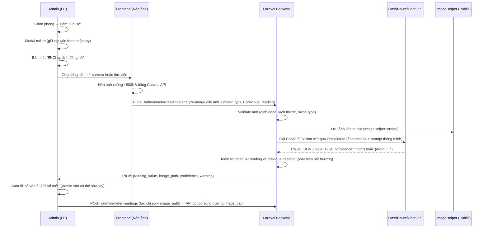

# Tích hợp AI Đọc Chỉ Số Điện Nước Từ Ảnh Chụp (AI Meter Reader)

Bổ sung tính năng chụp/tải ảnh đồng hồ điện nước lên hệ thống, AI (ChatGPT Vision qua OmniRoute) sẽ tự động phân tích và đọc chỉ số, điền vào form. Ảnh chụp được lưu lại làm minh chứng đối chiếu. **Tất cả các chức năng nhập tay hiện tại được giữ nguyên 100%**.

---

## Tổng quan luồng hoạt động



---

## Xử lý tất cả trường hợp ảnh bất thường

| # | Trường hợp | Tình huống thực tế | Xử lý tại | Cách xử lý |
|:--|:--|:--|:--|:--|
| 1 | **Ảnh mờ** | Rung tay, camera bẩn | AI + FE | AI trả `error: image_blurry` → FE hiện "Ảnh bị mờ, bật flash và chụp lại" + nút "Chụp lại" |
| 2 | **Ảnh quá tối** | Đồng hồ ở góc tối, gầm cầu thang | AI | AI trả `error: image_too_dark` → FE hiện "Ảnh quá tối, vui lòng bật đèn flash" |
| 3 | **Ảnh bị lóa / ngược sáng** | Nắng chiếu vào kính, flash phản chiếu | AI | AI trả `error: image_glare` → FE hiện "Ảnh bị lóa sáng, vui lòng đổi góc chụp" |
| 4 | **Không phải ảnh đồng hồ** | Chụp nhầm bức tường, ảnh ngẫu nhiên | AI | AI trả `error: no_meter_found` → FE hiện "Không tìm thấy đồng hồ trong ảnh" |
| 5 | **Ảnh chụp nghiêng/xoay** | Đồng hồ lắp ở vị trí khó | AI | GPT-4o vẫn đọc được ảnh xoay → Xử lý bình thường |
| 6 | **Số đang lửng lơ** | Đồng hồ cơ, con số đang chuyển | AI | AI đọc + trả `confidence: low` → FE hiện cảnh báo vàng kiểm tra lại |
| 7 | **Đồng hồ vỡ/hỏng mặt kính** | Số bị che khuất, mặt kính nứt | AI | AI trả `confidence: low` hoặc `error` → FE cho nhập tay |
| 8 | **File không hợp lệ** | Upload PDF, video, file corrupt | BE | Backend validate mime type trước khi gọi AI → Trả lỗi 422 |
| 9 | **File quá lớn** | Ảnh gốc 15-20MB từ camera | FE + BE | FE nén Canvas API → BE giới hạn max 10MB |
| 10 | **Ảnh có nhiều đồng hồ** | Cụm đồng hồ chung nhiều phòng | AI | Prompt yêu cầu đọc đồng hồ rõ nhất/to nhất + trả `confidence: medium` |

> [!IMPORTANT]
> **Nguyên tắc xử lý lỗi**: Tất cả trường hợp lỗi đều **không chặn** việc chốt số. Ảnh vẫn được lưu làm minh chứng, admin luôn có thể nhập tay. AI chỉ là trợ lý gợi ý, không phải bắt buộc.

---

## Proposed Changes

### Backend – Service Layer


Service gọi API ChatGPT Vision qua OmniRoute để phân tích ảnh đồng hồ:
api key , model , endpoit đã đc tôi làm trong .env và config rồi 

- **`analyzeMeterImage(string $imagePath, int $meterType, ?float $previousReading = null): array`**
  - Đọc file ảnh từ public path, convert sang base64
  - Xây dựng prompt thông minh xử lý tất cả edge cases:
    ```
    "Bạn là hệ thống đọc chỉ số đồng hồ {điện/nước} cho phòng trọ.
    Hãy phân tích ảnh và trả về JSON theo format chính xác sau:

    Nếu đọc được chỉ số:
    {"value": <số nguyên>, "confidence": "high|medium|low", "warning": null}

    Nếu KHÔNG đọc được, trả về MỘT trong các lỗi:
    {"error": "image_blurry"} - Ảnh mờ, không rõ nét
    {"error": "image_too_dark"} - Ảnh quá tối
    {"error": "image_glare"} - Ảnh bị lóa sáng, phản chiếu
    {"error": "no_meter_found"} - Không tìm thấy đồng hồ trong ảnh

    Quy tắc:
    - Chỉ đọc các chữ số MÀU ĐEN (số nguyên chính)
    - Bỏ qua các chữ số màu đỏ (phần thập phân lẻ)
    - Nếu số đang lửng lơ giữa 2 giá trị, làm tròn xuống và đặt confidence: low
    - Nếu có nhiều đồng hồ, đọc đồng hồ to nhất/rõ nhất và đặt confidence: medium
    - CHỈ trả về JSON thuần, không kèm markdown hay text nào khác"
    ```
  - Gửi request multimodal (text + image) tới OmniRoute endpoint với **timeout 15 giây**
  - Parse response JSON và trả về kết quả chuẩn hóa:
    ```php
    [
        'success' => true,
        'reading_value' => 1234,
        'confidence' => 'high',        // high | medium | low
        'warning' => null,             // Cảnh báo AI gửi kèm (nếu có)
        'anomaly_warning' => null,     // Cảnh báo kiểm tra chéo logic (xem bên dưới)
    ]
    ```
  - **Kiểm tra chéo logic** (nếu có `previousReading`):
    - AI đọc < `previousReading` → Thêm `anomaly_warning: "Chỉ số AI đọc (850) nhỏ hơn chỉ số cũ (963), vui lòng kiểm tra"`
    - Lượng tiêu thụ > 300% trung bình hợp lý → Thêm `anomaly_warning: "Lượng tiêu thụ bất thường cao, vui lòng xác nhận"`
  - Xử lý các trường hợp lỗi kỹ thuật:
    - OmniRoute timeout (>15s) → `success: false, error: 'ai_service_unavailable'`
    - OmniRoute trả HTTP error → `success: false, error: 'ai_service_unavailable'`
    - Response không phải JSON hợp lệ → `success: false, error: 'invalid_response'`

---

### Backend – Controller

#### [MODIFY] [MeterReadingController.php](file:///home/khang/RepoKyTucXaPhongTro/BE_StayHub/app/Http/Controllers/Admin/MeterReadingController.php)

**Thêm 1 method mới** `analyzeImage()`. Các method `init()` và `store()` hiện tại **giữ nguyên**, chỉ bổ sung nhỏ.

1. **Method mới `analyzeImage(Request $request)`**:
   - Validate request:
     - `image`: required, file, mimes:jpg,jpeg,png,webp, max:10240 (10MB)
     - `meter_type`: required, integer, in:1,2
     - `previous_reading`: nullable, numeric, min:0
   - Kiểm tra quyền admin
   - Lưu ảnh: `ImageHelper::create($image, 'meter-readings')`
   - Gọi `OmniRouteService::analyzeMeterImage($imagePath, $meterType, $previousReading)`
   - Trả về kết quả:
     ```json
     {
       "success": true,
       "result": {
         "reading_value": 1234,
         "confidence": "high",
         "warning": null,
         "anomaly_warning": null,
         "image_path": "/upload/meter-readings/20260620..._meter_abc123.jpg",
         "image_url": "http://localhost:8080/upload/meter-readings/20260620..._meter_abc123.jpg"
       }
     }
     ```

2. **Sửa method `store()` hiện tại**:
   - Thêm validation rule: `'image_path' => 'nullable|string|max:500'`
   - Khi `updateOrCreate`, bổ sung lưu `image_path` vào record

3. **Sửa method `init()` hiện tại**:
   - Trong phần trả về `existing_reading`, bổ sung trường `image_path` và `image_url` (dùng `ImageHelper::load()`) để FE hiển thị ảnh đã chụp trước đó nếu có

---

### Backend – Routes

#### [MODIFY] [api.php](file:///home/khang/RepoKyTucXaPhongTro/BE_StayHub/routes/api.php)

Thêm 1 route mới cho API phân tích ảnh:

```php
Route::post('meter-readings/analyze-image', [MeterReadingController::class, 'analyzeImage']);
```

> [!IMPORTANT]
> Route này phải đặt **trước** route `meter-readings` POST hiện tại để tránh conflict.

---

### Backend – Invoice Resources (Trả ảnh minh chứng cho Tenant)

Hiện tại `InvoiceItem` liên kết với `MeterReading` qua cột `meter_reading_id`. Khi Tenant xem chi tiết hóa đơn, các mục điện/nước (`InvoiceItemResource`) đã trả về thông tin `meterReading` (chỉ số cũ, mới, lượng tiêu thụ). Chúng ta chỉ cần **bổ sung thêm trường `image_url`** vào object `meter_reading` đó.

#### [MODIFY] [Tenant/InvoiceItemResource.php](file:///home/khang/RepoKyTucXaPhongTro/BE_StayHub/app/Http/Resources/Tenant/InvoiceItemResource.php)

Bổ sung `meter_reading` với `image_url` để Tenant xem ảnh chụp đồng hồ ngay trên hóa đơn:

```php
// Thêm vào mảng trả về:
'meter_reading' => $this->whenLoaded('meterReading', fn (): ?array => $this->meterReading ? [
    'id' => $this->meterReading->id,
    'previous_reading' => $this->meterReading->previous_reading,
    'current_reading' => $this->meterReading->current_reading,
    'consumption' => $this->meterReading->consumption,
    'reading_date' => optional($this->meterReading->reading_date)->toDateString(),
    'image_url' => ImageHelper::load($this->meterReading->image_path), // ← Ảnh minh chứng
] : null),
```

> **Hiệu quả**: Khi Tenant mở chi tiết hóa đơn trên App, ở mục "Tiền điện" và "Tiền nước", bên cạnh số liệu tiêu thụ sẽ có thêm nút/link xem ảnh chụp đồng hồ thực tế → Khách thuê tin tưởng, không tranh cãi.

#### [MODIFY] [Admin/InvoiceItemResource.php](file:///home/khang/RepoKyTucXaPhongTro/BE_StayHub/app/Http/Resources/Admin/InvoiceItemResource.php)

Tương tự, bổ sung `image_url` vào object `meter_reading` đang có sẵn (dòng 19-26):

```php
'meter_reading' => $this->whenLoaded('meterReading', fn (): ?array => $this->meterReading ? [
    // ... giữ nguyên các trường hiện tại ...
    'image_url' => ImageHelper::load($this->meterReading->image_path), // ← Thêm dòng này
] : null),
```

#### [MODIFY] [Tenant/InvoiceController.php](file:///home/khang/RepoKyTucXaPhongTro/BE_StayHub/app/Http/Controllers/Tenant/InvoiceController.php)

Đảm bảo khi query Invoice detail cho Tenant, eager load thêm quan hệ `items.meterReading` để `InvoiceItemResource` có dữ liệu để render `image_url`.

---

### Frontend – Nén ảnh trước khi upload (Tối ưu)

#### [NEW] `compress-image.ts` trong thư mục shared/lib/utils

Utility function nén ảnh bằng Canvas API của trình duyệt trước khi upload:
- Resize ảnh xuống max 1920px chiều rộng
- Nén chất lượng JPEG 80%
- Kết quả ~500KB-1MB (thay vì 5-10MB ảnh gốc từ camera)
- Tăng tốc upload đáng kể trên mạng 4G

---

### Frontend – Service Layer

#### [MODIFY] [meter-readings.service.ts](file:///home/khang/RepoKyTucXaPhongTro/FE_StayHub/src/features/admin/meter-readings/services/meter-readings.service.ts)

Thêm function mới:

- **`analyzeMeterImage(file: File, meterType: number, previousReading?: number)`**: Nén ảnh → Gửi lên API `POST admin/meter-readings/analyze-image` bằng `FormData`
- **Sửa `saveMeterReading()`**: Bổ sung trường `image_path` (optional) trong payload gửi lên

---

### Frontend – Types

#### [MODIFY] [meter-readings.model.ts](file:///home/khang/RepoKyTucXaPhongTro/FE_StayHub/src/features/admin/meter-readings/types/meter-readings.model.ts)

- Thêm interface `AnalyzeMeterImageResponse` cho response API phân tích ảnh
- Bổ sung `image_path` và `image_url` vào `ExistingMeterReading`
- Bổ sung `image_path` (optional) vào `SaveMeterReadingPayload`

---

### Frontend – UI Component

#### [MODIFY] [meter-readings-screen.tsx](file:///home/khang/RepoKyTucXaPhongTro/FE_StayHub/src/features/admin/meter-readings/components/meter-readings-screen.tsx)

Trong Modal "Chốt chỉ số - Phòng X", **bổ sung UI chụp/tải ảnh** cho mỗi khung đồng hồ (Điện / Nước). Giữ nguyên toàn bộ form nhập tay hiện tại.

**Thay đổi chi tiết trong Modal**:

1. **Thêm nút "📷 Chụp ảnh đồng hồ"** vào mỗi section đồng hồ Điện và Nước (bên trên ô "Chỉ số mới"):
   - Bấm vào → Mở `<input type="file" accept="image/*" capture="environment">` (mobile mở camera, desktop mở file picker)
   - Hiển thị ảnh preview thumbnail sau khi chọn/chụp xong
   - Ảnh tự động nén bằng `compressImage()` trước khi gửi

2. **Trạng thái khi đang phân tích ảnh**:
   - Hiện spinner + text "🤖 AI đang phân tích ảnh..." trên khu vực ảnh
   - Disable nút "Lưu chốt số" trong lúc đang xử lý

3. **Khi AI trả về kết quả thành công**:
   - Auto-fill giá trị đọc được vào ô "Chỉ số mới"
   - Hiển thị badge nhỏ: "✨ AI đã đọc: 1234" (admin có thể sửa tay lại)
   - Nếu `confidence: 'low'` → hiện cảnh báo vàng: "⚠️ AI không chắc chắn, vui lòng kiểm tra lại số"
   - Nếu `anomaly_warning` có giá trị → hiện cảnh báo cam: nội dung cảnh báo bất thường

4. **Khi AI trả về lỗi** (hiện thông báo tương ứng + **nút "🔄 Chụp lại"**):
   - `image_blurry` → "📷 Ảnh bị mờ, vui lòng bật flash và chụp lại rõ hơn"
   - `image_too_dark` → "🔦 Ảnh quá tối, vui lòng bật đèn flash hoặc di chuyển ra nơi sáng hơn"
   - `image_glare` → "☀️ Ảnh bị lóa sáng, vui lòng đổi góc chụp tránh phản chiếu"
   - `no_meter_found` → "🔍 Không tìm thấy đồng hồ trong ảnh, vui lòng chụp lại"
   - `ai_service_unavailable` → "⏳ Dịch vụ AI tạm thời không khả dụng, vui lòng nhập tay"
   - Tất cả trường hợp lỗi → **Ảnh vẫn được lưu** làm minh chứng, admin nhập số bằng tay

5. **Hiển thị ảnh đã chốt trước đó**:
   - Nếu `existing_reading` có `image_url`, hiển thị thumbnail ảnh đã chốt kỳ trước (có thể bấm phóng to xem)

6. **Truyền `image_path` khi lưu**:
   - Khi bấm "Lưu chốt số", gửi kèm `image_path` (đường dẫn ảnh đã upload) trong payload `saveMeterReading()`

---

## Verification Plan

### Manual Verification
1. **Happy path**: Chụp ảnh đồng hồ rõ nét → AI đọc đúng số → Auto-fill → Lưu thành công kèm ảnh
2. **Ảnh mờ**: Chụp ảnh mờ → Hiện thông báo lỗi phù hợp + nút Chụp lại → Vẫn nhập tay được
3. **Ảnh tối**: Chụp ảnh trong hành lang tối → Hiện cảnh báo bật flash
4. **Ảnh lóa sáng**: Chụp với flash phản chiếu trên kính → Hiện cảnh báo đổi góc
5. **Ảnh không phải đồng hồ**: Upload ảnh bất kỳ → Hiện "Không tìm thấy đồng hồ"
6. **AI không khả dụng (tắt OmniRoute)**: Hiện thông báo lỗi → Nhập tay bình thường
7. **Giữ nguyên nhập tay**: Không chụp ảnh, nhập tay như cũ → Hoạt động bình thường 100%
8. **AI đọc sai**: AI gợi ý sai số → Admin sửa lại trong ô input → Lưu đúng
9. **Kiểm tra chéo**: AI đọc số < chỉ số cũ → Hiện cảnh báo bất thường
10. **Kiểm tra validation backend**: Chỉ số mới < chỉ số cũ → Báo lỗi (giữ nguyên logic hiện tại)
11. **Xem ảnh đã lưu**: Mở lại modal phòng đã chốt → Hiển thị ảnh đồng hồ đã chụp
12. **Tenant xem ảnh minh chứng**: Tenant mở chi tiết hóa đơn → Thấy ảnh đồng hồ điện/nước

### Automated Tests
```bash
# Chạy lint check để đảm bảo không lỗi cú pháp
docker compose exec app php artisan route:list --path=meter-readings
```
nhớ là request nhận trong thư mục request , controller xử lí , trả resource  và api không cần tách ra thêm services